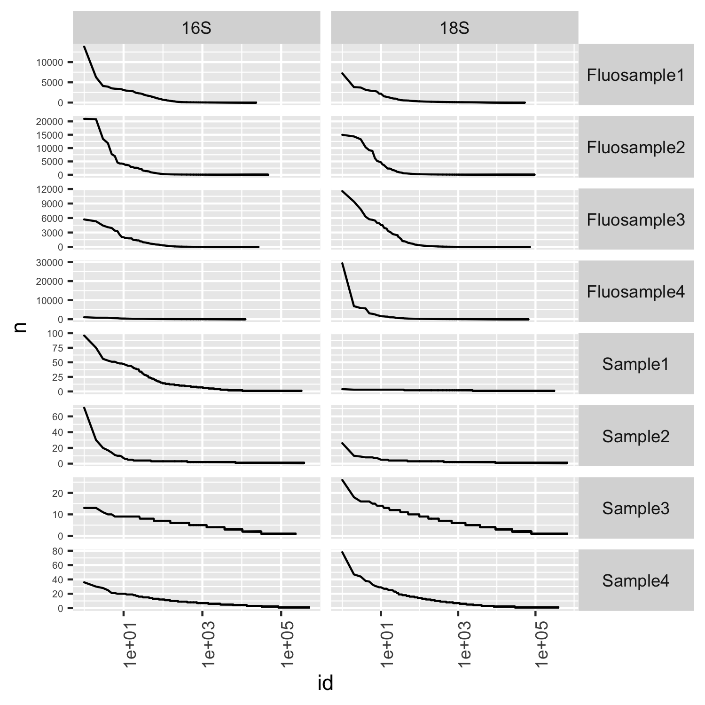
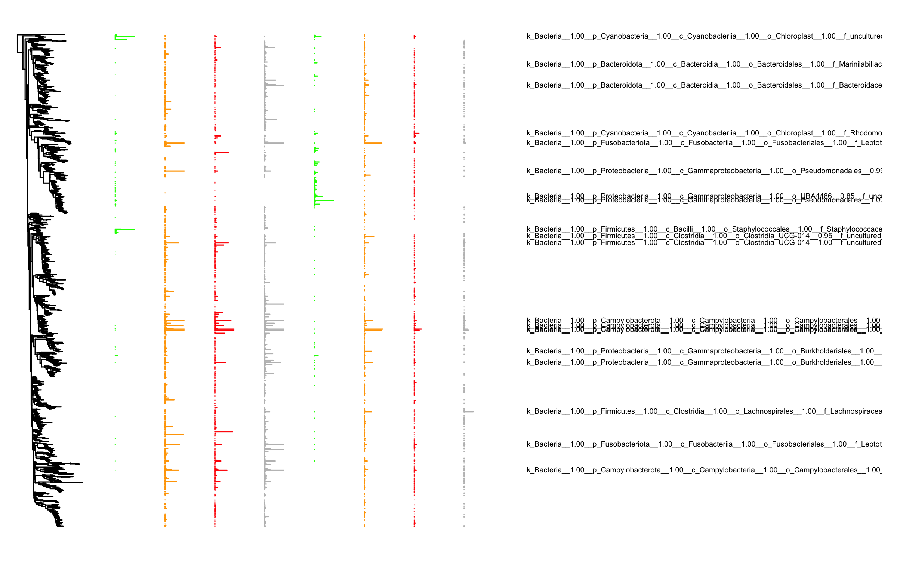

## Samples

-   Fluosample1: Rhodomonas and Ochromonas cells; emulsion PCR in
    HFE7500 + 5% RAN surfactant
-   Fluosample2: Frozen waterwater + Rhodo and Ochro cells; 10e3 cells /
    ml; emulsion PCR in HFE7500 + 5% RAN surfactant
-   Fluosample3: Frozen waterwater + Rhodo and Ochro cells; 10e4 cells /
    ml; emulsion PCR in HFE7500 + 5% RAN surfactant
-   Fluosample4: Frozen wastewater; emulsion PCR in HFE7500 + 5% RAN
    surfactant
-   Sample1: Rhodomonas and Ochromonas cells; emulsion PCR in mineral
    oil + 4% Abil EM90
-   Sample2: Frozen waterwater + Rhodo and Ochro cells; 10e3 cells / ml;
    emulsion PCR in mineral oil + 4% Abil EM90
-   Sample3: Frozen waterwater + Rhodo and Ochro cells; 10e4 cells / ml;
    emulsion PCR in mineral oil + 4% Abil EM90
-   Sample4: Frozen wastewater; emulsion PCR in mineral oil + 4% Abil
    EM90

## Barcode distributions

<table>
<tr>
<td>
Barcode distribution
</td>
<td>
Barcode taxonomy distribution
</td>
</tr>
<tr>
<td valign="top">

</td>
<td valign="top">

</td>
</tr>
</table>

## Distribution of connections

<td valign="top">

</td>

## Abundance profiles

The abundance columns are:

-   Fluosample1:Rhodomonas and Ochromonas
    cells; emulsion PCR in HFE7500 + 5% RAN surfactant
-   Fluosample2: Frozen waterwater + Rhodo and Ochro cells; 10e3 cells /
    ml; emulsion PCR in HFE7500 + 5% RAN surfactant
-   Fluosample3: Frozen waterwater + Rhodo and Ochro cells; 10e4 cells /
    ml; emulsion PCR in HFE7500 + 5% RAN surfactant
-   Fluosample4: Frozen wastewater; emulsion PCR in HFE7500 + 5% RAN
    surfactant
-   Sample1: Rhodomonas and Ochromonas cells; emulsion PCR in mineral
    oil + 4% Abil EM90
-   Sample2: Frozen waterwater + Rhodo and Ochro cells; 10e3 cells / ml;
    emulsion PCR in mineral oil + 4% Abil EM90
-   Sample3: Frozen waterwater + Rhodo and Ochro cells; 10e4 cells / ml;
    emulsion PCR in mineral oil + 4% Abil EM90
-   Sample4: Frozen wastewater; emulsion PCR in mineral oil + 4% Abil
    EM90

<td valign="top">

</td>
<td valign="top">

</td>

## Tanglegram of the mineral oil reactions

The abundance columns are:

-   Sample1: Rhodomonas and Ochromonas cells; emulsion PCR in mineral
    oil + 4% Abil EM90
-   Sample2: Frozen waterwater + Rhodo and Ochro cells; 10e3 cells / ml;
    emulsion PCR in mineral oil + 4% Abil EM90
-   Sample3: Frozen waterwater + Rhodo and Ochro cells; 10e4 cells / ml;
    emulsion PCR in mineral oil + 4% Abil EM90
-   Sample4: Frozen wastewater; emulsion PCR in mineral oil + 4% Abil
    EM90

<td valign="top">

</td>

## Tanglegram of the HFE7500 reactions

The abundance columns are:

-   Fluosample1: Rhodomonas and Ochromonas cells; emulsion PCR in
    HFE7500 + 5% RAN surfactant
-   Fluosample2: Frozen waterwater + Rhodo and Ochro cells; 10e3 cells /
    ml; emulsion PCR in HFE7500 + 5% RAN surfactant
-   Fluosample3: Frozen waterwater + Rhodo and Ochro cells; 10e4 cells /
    ml; emulsion PCR in HFE7500 + 5% RAN surfactant
-   Fluosample4: Frozen wastewater; emulsion PCR in HFE7500 + 5% RAN
    surfactant

<td valign="top">

</td>
