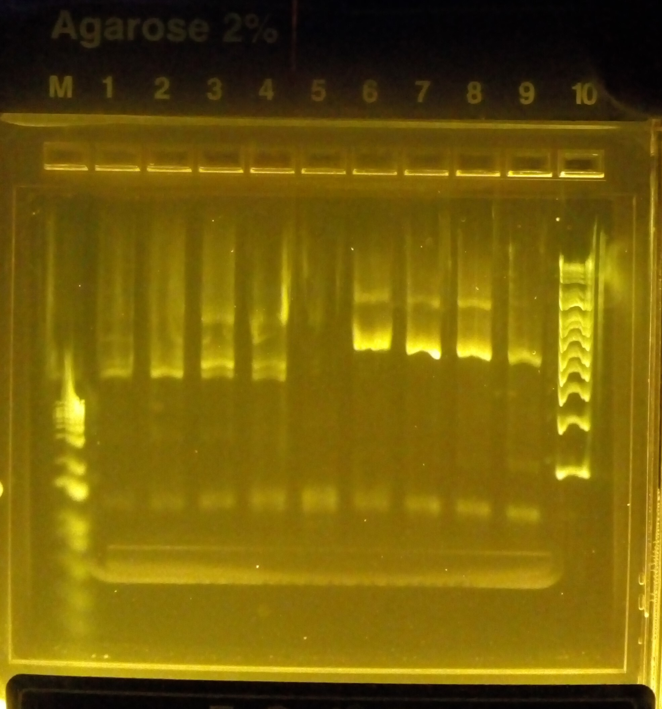
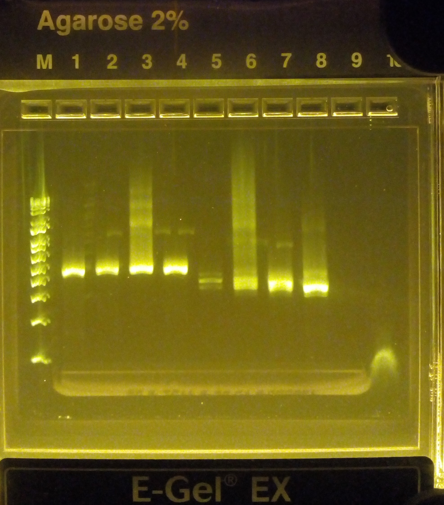
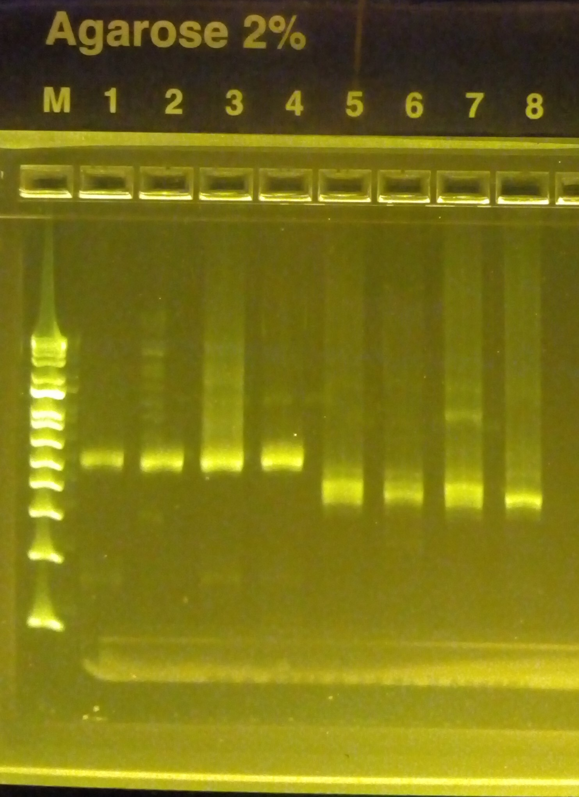

## Polyacrylamide bead formation

For each sample:

a) Combine the following reagents in a 2 ml round-bottom safe-lock microtube and vortex gently: 
- 120 µl sample material 
- 80 µl 30% BIS/acrylamide (storage temp: 4 °C) 
- 25 µl 10% APS (storage temp: -20 °C)

Samples:
- 1: rhodomonas + ochromonas about 10e4 cells/ml: 25µl + 50 µl, respectively.
- 2: wastewater (ww) + rhodos + ochros 10e3 cells/ml: 45µl + 2.5 µl + 5 µl, respectively + K/2 medium 67.5 µl.
- 3: ww + rhodos + ochros 10e4 cells/ml: 45µl + 25 µl + 50 µl, respectively.
- 4: ww: 45 µl + K/2 medium 75 µl

b) Shake & mix STT (Span/Tween/Triton) emulsion oil thoroughly before use!  
Add 600 µl STT emulsion oil. (storage temp: RT) 
Vortex at max speed (3 000 rpm) for 30 s.

c) Add 25 µl TEMED.  (storage temp: RT) 
Vortex at max speed (3 000 rpm) for 30 s.

d) Allow tube to sit on the benchtop for polymerization to occur for 1h 30 min

e) Removal of oil:
- Equal volumes of water and diethyl ether (at least 50 % water!) mixed, shaken and opened occasionally to prevent pressure from building up.
- Add 800 µl of diethyl ether to the tube, then immediately close, invert and flick the tube to mix the emulsion with the ether. A visible precipitate ought to form. Draw off the ether/oil mixture around the precipitate and discard.
- Add 1 ml of autoclaved H2O to the top of the tube and mix by flicking and inverting. Centrifuge for 30 s at 12 000rcf. Three layers should form: a bottom layer of beads, a middle cloudy layer of oil/water, and a top milky layer of oil. Draw off the top oil layer as much as possible and discard.
- Repeat the H2O wash steps until there is no remaining oil at the top of the tube and the liquid phase is transparent.

## Fusion PCR
Prepare the PCR master mix (two lots prepared separately for the ABIL emulsion oil samples and fluorinated oil samples:

| Reagent | 1X | 4X |
| :---: | :---: | :---: |
| 5xGC buffer | 20 µl | 80 µl
| 50 mM MgCl2 | 2 µl | 8 µl |
| dNTP mix (10 mM each) | 2.5 µl | 10 µl |
| 10 µM R2 and F1 primers (3, each) | 10 µl | 40 µl |
| 10 µM R1-F2’ and F2-R1' primers (4, each)  | 1 µl | 4 µl |
| 1e6 cp/µl barcode | 1 µl | 4 µl |
| Phusion DNA polymerase (2 U/µl) | 8 µl | 32 µl |

###### ABIL emulsion oil samples

a) Add 1mm glass beads

b) Add 32,5 µl of sample and 67,5 µl of master mix

c) Add 900 µl of 4 % ABIL emulsion oil. Emulsify by vortexing at max speed (3 000 rpm) for 1 min. 

d) Aliquot 50 µl of emulsion from each tube to as many PCR tubes as possible

###### Fluorinated oil samples

a)  Combine 16 µl of sample (bead suspension) and 34 µl of master mix. Add 50 µl of fluorinated oil with surfactant (RAN Biotechnologies).

b)  Emulsify by vortexing and repeated pipetting.

c)  Aliquot to two PCR tubes and cover with 30 µl of mineral oil. 

###### Running PCR:

| Step | Temperature (°C) | Time | Number of cycles |
| :---: | :---: | :---: | :---: |
| Beginning temperature | 80 | 10 s | 1 |
| Initial denaturation | 94 | 30 s | 1 |
| Denaturation | 94 | 5 s | 32 |
| Annealing | 55 | 30 s | 
| Extension | 72 | 30 s | 
| Final extension | 72 | 5 min | 1
| Storing temperature | 4 | Inf | 1

###### Cleanup for the ABIL emulsion oil samples

a) Add 1 ml of well-shaken water-saturated diethyl ether (top phase). 
- Vortex gently to mix contents. 
- Centrifuge for 1 min at 13 000 rcf to separate the phases.  
- Dispose of the upper (solvent with oil) phase.  

b) Add 50 µl of PCR H2O. 
- Repeat step a) and then continue to step c).  

c) Add 1 ml of well-shaken water-saturated ethyl acetate (top phase). 
- Vortex to mix contents. 
- Centrifuge for 1 min at 13 000 rcf to separate phases 
- Dispose of upper ethyl acetate phase. 

d) Perform two more extractions with diethyl ether: 
- Add 1 ml of water-saturated diethyl ether. 
- Vortex gently to mix contents. 
- Centrifuge for 1 min at 13,000 rcf to separate the phases.  
- Dispose of the upper (solvent) phase.  

e) Leave the samples open in a laminar hood or covered area for at least 3 min so the remaining diethyl ether can evaporate.  

f) Avoiding the pipetting of the middle emulsion residual layer, pellet or any strange floating particles, collect 100-200 µl (or as much as you can) from the bottom phase to a new 1,5 ml tube. 

g) Cleanup with Monarch® PCR & DNA Cleanup Kit (5 μg).

###### Cleanup for the fluorinated oil samples

a) Immediately after the fusion reaction, pool the emulsion aliquots for each sample into a new 2 ml round-bottom safe-lock tube.

b) Separate the phases (top: mineral oil, middle: emulsion, bottom: surplus fluorinated oil) by spinning and discard the mineral oil. Some fluorinated oil may also be removed, if applicable.

c) Add 50 µl of PFO, mix and spin. The upper aqueous phase is collected / bottom phase discarded

d) Cleanup with Monarch® PCR & DNA Cleanup Kit (5 μg).

## 16S and 18S blocking

Prepare the PCR master mix (made separately for the ABIL emulsion oil and fluorinated oil samples):
| Reagent | 1X | 16X |
| :---: | :---: | :---: |
| PCR H2O | 23.5 µl | 116 µl |
| 5xGC buffer | 10 µl | 80 µl |
| dNTP mix (10 mM each) | 1 µl | 8 µl |
| 32 µM BlockF-16S and BlockR-16S primers (each | 5 µl | 40 µl |
| 32 µM BlockF-18S and BlockR-18S primers (each) | 5 µl | 40 µl |
| Phusion DNA polymerase (2 U/µl) | 0.5 µl | 4 µl |

Combine 46 µl mastermix and 4 µl template (purified fusion PCR product), two replicates of each sample

Running PCR:
| Step | Temperature (°C) | Time | Number of cycles |
| :---: | :---: | :---: | :---: |
| Beginning temperature | 98 | 30 s | 1 |
| Denaturation | 98 | 10 s | 30 |
| Annealing | 55 | 30 s | 
| Extension | 72 | 30 s | 
| Final extension | 72 | 5 min | 1
| Storing temperature | 4 | Inf | 1

Cleanup with Monarch® PCR & DNA Cleanup Kit (5 μg).

## Nested PCR 

Prepare 2 PCR master mixes (with either 16S and 18S nested primers), (made separately for the ABIL emulsion oil and fluorinated oil samples):
| Reagent | 1X | 8X |
| :---: | :---: | :---: |
| PCR H2O | 14.75 µl | 118 µl |
| 5xGC buffer | 5 µl | 40 µl |
| dNTP mix (10 mM each) | 0.5 µl | 4 µl |
| Primer mix * either 16S or 18S | 2.5 µl | 7.5 µl |
| Phusion DNA polymerase (2 U/µl) | 0.5 µl | 2 µl |

(*) Primer mixes: 
- 16S: 16S nested primers (3 primers), i5 forward, BlockF, BlockR; (3µM each) 
- 18S: 18S nested primers (3 primers), i5 forward, BlockF, BlockR; (3µM each)

Combine 46 µl mastermix + 4 µl of sample (from blocking PCR), two replicates of each sample 

Running PCR:
| Step | Temperature (°C) | Time | Number of cycles |
| :---: | :---: | :---: | :---: |
| Beginning temperature | 98 | 30 s | 1 |
| Denaturation | 98 | 10 s | 24 |
| Annealing | 55 | 30 s | 
| Extension | 72 | 30 s | 
| Final extension | 72 | 5 min | 1
| Storing temperature | 4 | Inf | 1

Replicate samples pooled and cleanup with Monarch® PCR & DNA Cleanup Kit (5 μg).

Visualizing results with Invitrogen E-Gel: 
- Device: Invitrogen E-Gel® iBase™ 
- Agarose gel casket: Invitrogen E-Gel® EX with SYBR® Gold II, 2% agarose 

###### ABIL emulsion oil samples

<td valign="top"></td>

M. 1 kB MW marker 
1. 16S sample 1 
2. 16S sample 2 
3. 16S sample 3 
4. 16S sample 4 
5. 18S sample 1 
6. 18S sample 2 
7. 18S sample 3 
8. 18S sample 4

###### Fluorinated oil samples

<td valign="top"></td>

5. 16S sample 2
6. 18S sample 2 
7. 16S sample 3 
8. 18S sample 3 
9. 16S sample 4 
10. 18S sample 4 

16S/18S sample 1 missing as it was prepared separately.

## Indexing

16S and 18S barcoding experiments were further prepared for sequencing using indexing primers.

Primers used (A = ABIL samples, F = fluorinated samples):

| | N701 | N702 | N703 | N704 |
| :---: | :---: | :---: | :---: | :---: |
| **S502** | A Sample 1, 16S | A Sample 2, 16S  | A Sample 3, 16S | A Sample 4, 16S |
| **S503** | A Sample 1, 18S | A Sample 2, 18S  | A Sample 3, 18S | A Sample 4, 18S |
| **S507** | F Sample 1, 16S | F Sample 2, 16S  | F Sample 3, 16S | F Sample 4, 16S |
| **S508** | F Sample 1, 18S | F Sample 2, 18S  | F Sample 3, 18S | F Sample 4, 18S |

 Prepare following PCR mix (4× per sample + 1 extra volume; performed separately to the two sample sets):

| Reagent | 1X | 5X | 8X |
| :---: | :---: | :---: | :---: |
| H2O | 12,4 µl | 62 µl | 99.2 µl |
| 5x HF buffer | 4 µl | 20 µl | 32 µl |
| dNTP mix (10 mM each) | 0.4 µl | 2 µl | 3.2 µl |
| Phusion DNA polymerase (2 U/µl) | 0,2 µl | 1 µl | 1.6 µl |
| i5 primer (10 µM) | 1 µl | 5 µl | - |
| i7 primer (10 µM) | 1 µl | 5 µl | - |

ABIL samples: Pipette 19 µl mastermix, 1 µl of appropriate primers each, and 1 µl template (purified nested PCR product) to 4 PCR tubes per sample
Fluorinated samples: Pipette 17 µl mastermix, 1 µl both of correct primers and 1 µl template (purified nested PCR product) 

Running PCR:

| Step | Temperature (°C) | Time | Number of cycles |
| :---: | :---: | :---: | :---: |
| Beginning temperature | 98 | 30 s | 1 |
| Denaturation | 98 | 10 s | 12 |
| Annealing | 55 | 20 s | 
| Extension | 72 | 20 s | 
| Final extension | 72 | 5 min | 1
| Storing temperature | 4 | Inf | 1

Pool replicate samples, purify with Monarch® PCR & DNA Cleanup Kit (5 μg).

DNA concentration was measured by fluorometry (Qubit) and quality evaluated by electrophoresis.

###### ABIL emulsion oil samples:

<td valign="top"></td>

M. 1 kB MW marker 
1. 16S sample 1 
2. 16S sample 2 
3. 16S sample 3 
4. 16S sample 4 
5. 18S sample 1 
6. 18S sample 2 
7. 18S sample 3 
8. 18S sample 4 
9. Blank 
10. Negative control (no template, primers N704 and S503) 

The concentration in the same order as above, in µg/ml: 
1. 57.8 
2. 46.6 
3. 68.8 
4. 32.4 
5. 7.8
6. 44.6 
7. 37.8 
8. 62.2

###### Fluorinated oil samples

<td valign="top"></td>

M. 1 kB MW marker
1. 16S sample 1 
2. 16S sample 2 
3. 16S sample 3 
4. 16S sample 4 
5. 18S sample 1
6. 18S sample 2 
7. 18S sample 3
8. 18S sample 4 

The concentration in the same order as above, in ng/µl: 

1. 13.6 
2. 17.8 
3. 28.2 
4. 19.4 
5. 17.8 
6. 9.8 
7. 21.1 
8. 19.8 

## Library construction and sequencing

a) Library was constructed by pooling the samples and diluted with Qiagen elution buffer to 4 nM.

b) Prepare a Fresh Dilution of NaOH  
- Combine the following volumes in a microcentrifuge tube: Laboratory-grade water (800 μl) and Stock 1.0 N NaOH (200 μl) 
- Invert the tube several times to mix.  

c) Prepare HT1  
- Remove HT1 from -25°C to -15°C storage and thaw at room temperature.  
- Store at 2°C to 8°C until you are ready to dilute denatured libraries.  

d) Denature a 4 nM Library  
- Combine the following volumes in a microcentrifuge tube: 4 nM library (5 μl) + 0.2N NaOH (5 μl)  
- Vortex briefly and then centrifuge at 280 × g for 1 minute.  
- Incubate at room temperature for 5 minutes.  
- Add 990 μl prechilled HT1 to the tube containing denatured library. The result is 1 ml of a 20 pM denatured library.  

e) Dilute Denatured 20 pM Library to 8pM
- Dilute to the desired concentration using the following volumes: 20 pM library (240 μl) + Prechilled HT1 (360 μl)  
- Invert to mix and then pulse centrifuge.  

f) Load the sample into the cartridge. 
