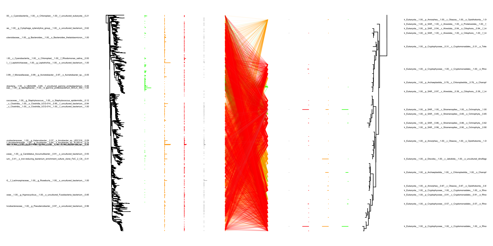

## Samples

- Fluosample1: Rhodomonas and Ochromonas cells; emulsion PCR in HFE7500 + 5% RAN surfactant
- Fluosample2: Frozen waterwater + Rhodo and Ochro cells; 10e3 cells / ml; emulsion PCR in HFE7500 + 5% RAN surfactant
- Fluosample3: Frozen waterwater + Rhodo and Ochro cells; 10e4 cells / ml; emulsion PCR in HFE7500 + 5% RAN surfactant
- Fluosample4: Frozen wastewater; emulsion PCR in HFE7500 + 5% RAN surfactant
- Sample1: Rhodomonas and Ochromonas cells; emulsion PCR in mineral oil + 4% Abil EM90
- Sample2: Frozen waterwater + Rhodo and Ochro cells; 10e3 cells / ml; emulsion PCR in mineral oil + 4% Abil EM90
- Sample3: Frozen waterwater + Rhodo and Ochro cells; 10e4 cells / ml; emulsion PCR in mineral oil + 4% Abil EM90
- Sample4: Frozen wastewater; emulsion PCR in mineral oil + 4% Abil EM90

## Barcode distributions

<table>
  <tr>
    <td>Barcode distribution</td>
    <td>Barcode taxonomy distribution</td>
  </tr>
  <tr>
    <td valign="top"></td>
    <td valign="top"></td>
  </tr>
 </table>

## Distribution of connections

<td valign="top"></td>

## Bacterial abundance profile

<td valign="top"></td>

## Eukaryotic abundance profile

<td valign="top"></td>

## Tanglegram of the mineral oil reactions

<td valign="top"></td>

## Tanglegram of the HFE7500 reactions

<td valign="top"></td>

## Source
<a download="report.Rmd" href="`r base64enc::dataURI(file = params$rmd, mime = 'text/rmd', encoding = 'base64')`">R Markdown source file (to produce this document)</a>

